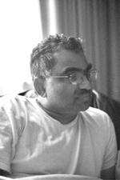
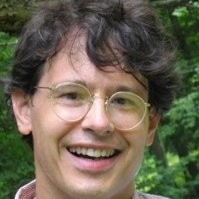
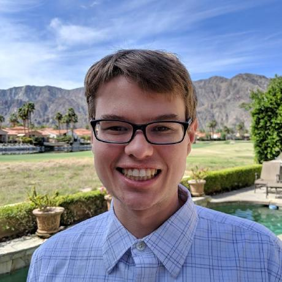
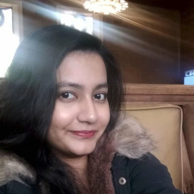
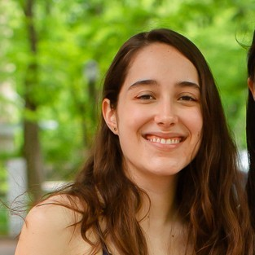
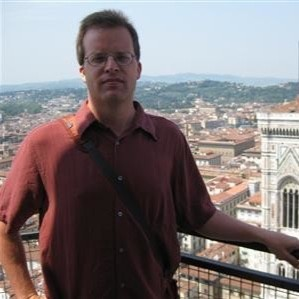
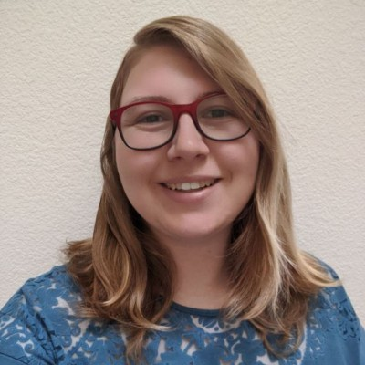
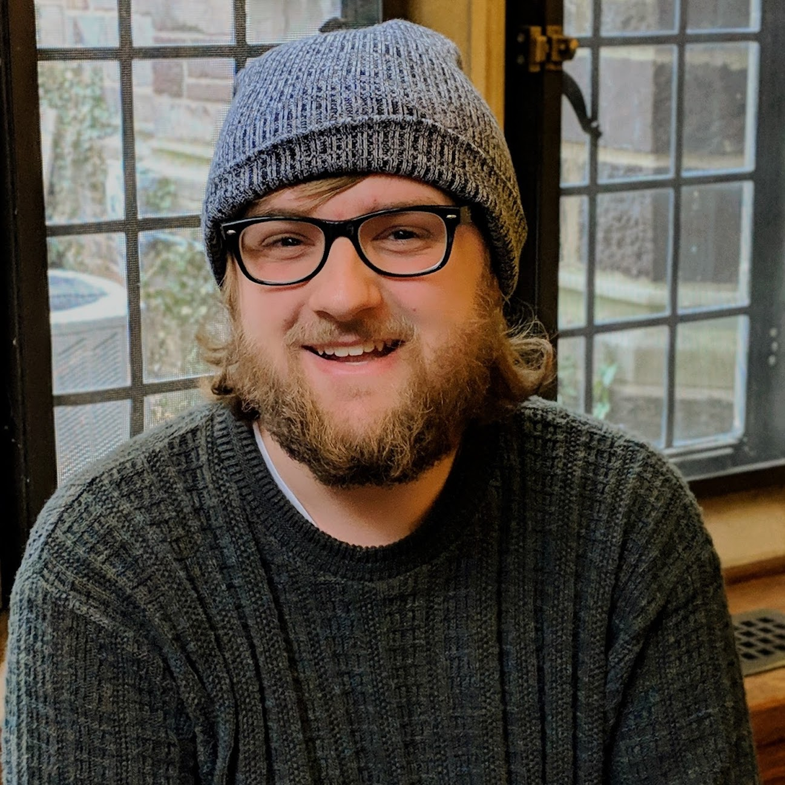

The Team                                                                    
========

Here we introduce the current members of the team.

Instrument Team
---------------

- Shri Kulkarni, Project Scientist, Caltech

- Don Neill, Instrument Scientist, Caltech

- Michael Coughlin, Project Scientist, University of Minnesota
                               

I am currently an Assistant Professor of Physics and
Astronomy at the University of Minnesota. I am excited about using
SEDMv2 to discover the counterparts to gravitational waves, both
found by current instruments such as LIGO and future instruments such
as LISA, following up objects identified by surveys such as the 
Zwicky Transient Facility.

- Yashvi Sharma, Science Operations Lead, Caltech

- Saarah Hall, Reduction Pipelines, Northwestern University

- Reed Riddle, Robotic Software Lead, Caltech

                   
- Lauren Fahey, Mechanical Engineer, Caltech

- Jason Fucik, Optical Engineer, Caltech

- Josiah Purdum, Observatory Operations, Caltech

Science Team
------------

- Tyler Barna, Graduate Student, University of Minnesota

- Alexander Criswell, Graduate Student, University of Minnesota

.. image:: images/criswell.jpeg
   :height: 200px
   :width: 200px

- Brendan King, Graduate Student, University of Minnesota

